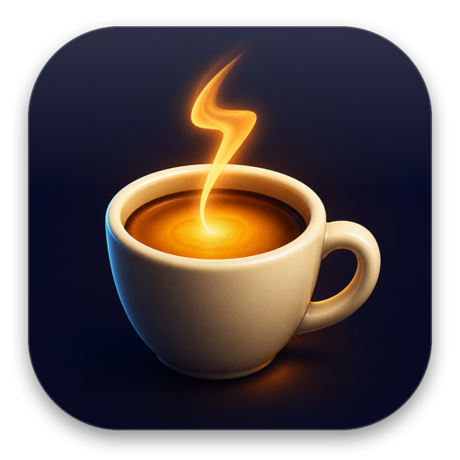
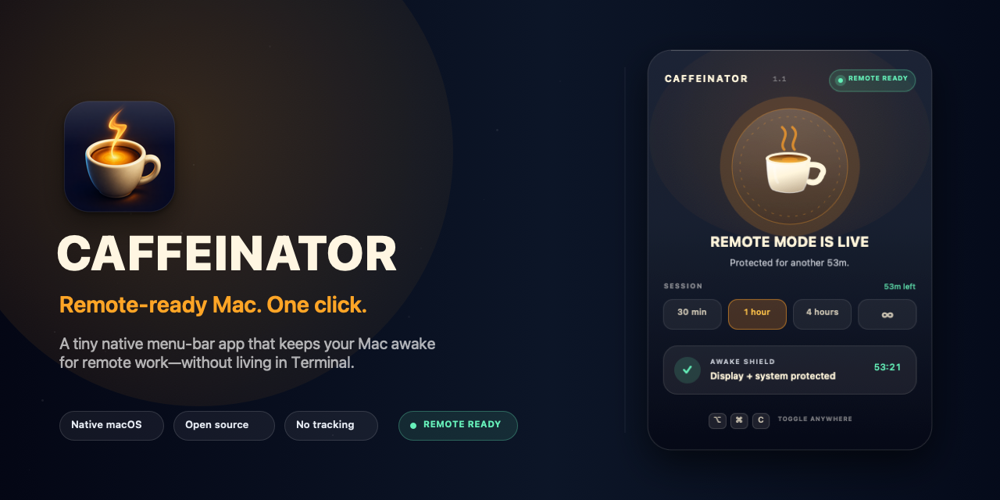
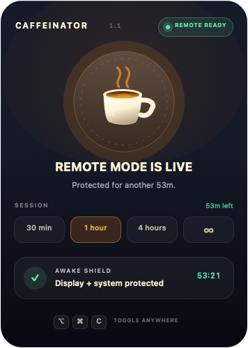
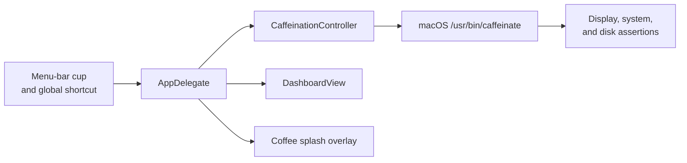

<p align="center">
  
</p>

<h1 align="center">Caffeinator</h1>

<p align="center">
  <strong>Remote-ready Mac. One click.</strong>
</p>

<p align="center">
  A tiny native macOS menu-bar app that keeps your Mac awake for remote work—with a little coffee splash instead of another Terminal ritual.
</p>

<p align="center">
  <a href="../../releases/latest"><strong>Download the latest release</strong></a>
  ·
  <a href="docs/INSTALL.md">Installation</a>
  ·
  <a href="CONTRIBUTING.md">Contributing</a>
</p>

<p align="center">
  
  
  
  
</p>



## The story

I kept repeating the same small failure:

1. Start a remote Codex task.
2. Lock my Mac and walk away.
3. Remember—too late—that I forgot to run `caffeinate`.
4. Come back to a sleeping Mac and interrupted work.

The Terminal command was never the hard part. **Remembering it was.**

Activity Monitor could tell me whether the process was still alive, but that meant opening another tool and checking another list. The state that mattered most—_is this Mac safe to leave?_—was invisible at the exact moment I needed it.

So I turned that ritual into one coffee cup:

- Click once: the Mac is caffeinated.
- See the coffee splash: the state change is unmistakable.
- Pick a duration: it turns itself off.
- Click again: normal sleep behavior returns immediately.

No accounts. No analytics. No cloud service. Just a small native utility that makes the safe action the easy action.

## What it does

- Prevents idle display sleep, system sleep, and disk sleep through macOS's built-in `/usr/bin/caffeinate`.
- Offers 30-minute, 1-hour, 4-hour, and unlimited sessions.
- Shows active, standby, elapsed-time, and remaining-time states at a glance.
- Toggles globally with <kbd>⌥</kbd><kbd>⌘</kbd><kbd>C</kbd>, without Accessibility permission.
- Throws a non-interactive coffee animation over the current screen when activated.
- Releases every assertion when the session ends, the cup is clicked again, or the app quits.

<p align="center">
  
</p>

## Install

### Download

1. Open the [latest release](../../releases/latest).
2. Download `Caffeinator-macOS.zip`.
3. Unzip it and move `Caffeinator.app` to **Applications**.
4. Open Caffeinator.

The downloadable build is ad-hoc signed rather than Developer ID notarized. On first launch, macOS may ask you to Control-click the app and choose **Open** once. See the complete [installation guide](docs/INSTALL.md).

### Build from source

Requirements:

- macOS 13 or later
- Apple Command Line Tools

```bash
git clone https://github.com/athridev/caffeinator-mac.git
cd caffeinator-mac
make build
open dist/Caffeinator.app
```

The build is universal for Apple Silicon and Intel Macs.

## Controls

| Action | Control |
| --- | --- |
| Toggle caffeine | Click the menu-bar cup |
| Toggle from any app | <kbd>⌥</kbd><kbd>⌘</kbd><kbd>C</kbd> |
| Inspect without toggling | Option-click the cup |
| Choose a timed session | Click `30 min`, `1 hour`, `4 hours`, or `∞` |
| Choose with the keyboard | Press <kbd>1</kbd>–<kbd>4</kbd> in the popup |
| Toggle in the popup | <kbd>Space</kbd> or <kbd>Return</kbd> |
| Close the popup | <kbd>Esc</kbd> |
| More controls | Right-click the menu-bar cup |

## Privacy and efficiency

Caffeinator is intentionally boring under the hood:

- No networking
- No telemetry or analytics
- No accounts or stored personal data
- No third-party runtime dependencies
- No Electron or embedded browser
- No persistent animation loop

The UI is native AppKit. Visual refresh runs only while the short popup or splash animation is visible, then stops. A local smoke test measured **0.0% idle CPU** and roughly **40 MB RSS**.

Read the full [privacy statement](docs/PRIVACY.md).

## Architecture



The app is deliberately small:

- `AppDelegate.swift` coordinates menu-bar, popup, shortcuts, and session state.
- `CaffeinationController.swift` owns the child process and timed expiration.
- `Dashboard.swift` draws the compact status and duration interface.
- `SplashOverlay.swift` renders the click-through coffee animation.
- `GlobalHotKey.swift` registers the global shortcut through Carbon.

See [architecture details](docs/ARCHITECTURE.md).

## Development

```bash
make build      # Build dist/Caffeinator.app and the release zip
make test       # Run assertion, timer, hotkey, signing, and archive checks
make preview    # Render the active and standby UI states
```

Pull requests are welcome. Start with [CONTRIBUTING.md](CONTRIBUTING.md), and please use [GitHub Issues](../../issues) for bugs or focused feature proposals.

Maintainers can follow the [release and launch checklist](docs/LAUNCH.md).

## License

Caffeinator is available under the [MIT License](LICENSE).
