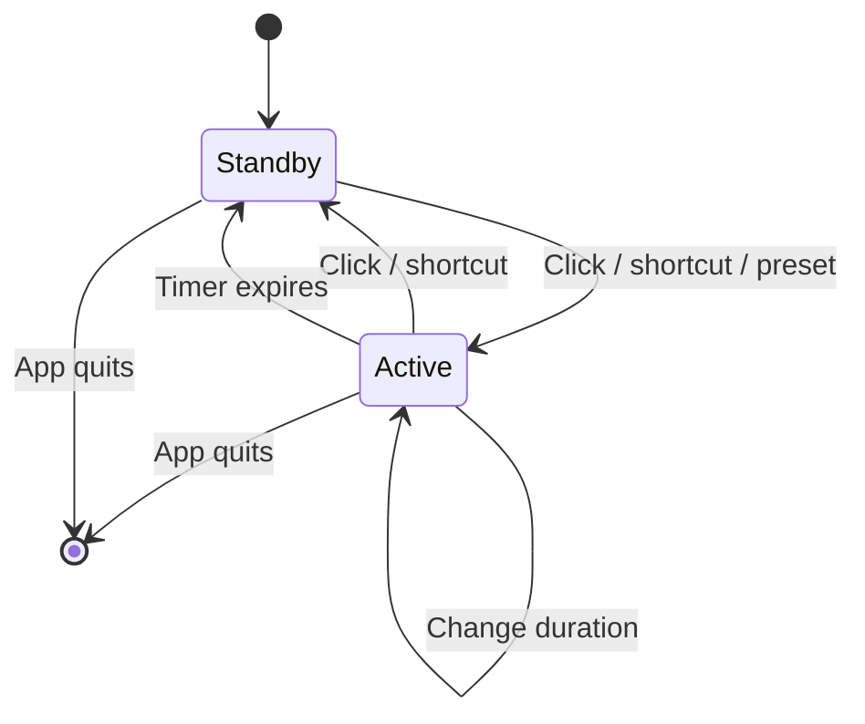

# Architecture

Caffeinator is a menu-bar-only AppKit application with one child process while active.

## Components

### `AppDelegate`

Owns the menu-bar item, popup panel, global shortcut, context menu, UI synchronization, and overlay coordinator. It is the boundary between user input and session state.

### `CaffeinationController`

Owns the awake-state lifecycle:

1. Launch `/usr/bin/caffeinate -d -i -m`.
2. Record the session start, preset, and optional end time.
3. Schedule one expiration timer for timed sessions.
4. Terminate the child process on stop, expiration, or app termination.

The controller does not draw UI.

### `DashboardView`

A code-drawn AppKit view for the status panel. It renders:

- active and standby states
- duration presets
- elapsed or remaining time
- shortcut hints
- hover and focus feedback

Fast redraw runs only for the short visible animation window. It falls back to a one-second clock update while the panel remains open and active, then stops when hidden.

### `SplashOverlay`

Creates a click-through, non-activating panel on the current screen. Coffee particles and the confirmation toast are drawn procedurally for less than two seconds, after which the overlay closes and releases its timer.

### `GlobalHotKey`

Registers <kbd>⌥</kbd><kbd>⌘</kbd><kbd>C</kbd> with Carbon's `RegisterEventHotKey`. This avoids an Accessibility permission prompt.

## Resource lifecycle

Every transition out of `Active` calls `stop()`, invalidates the timer, terminates the child process, and clears session state.

## Build

`build.sh` compiles arm64 and x86_64 binaries with `swiftc`, combines them with `lipo`, composes the icon set, creates the `.app` bundle, ad-hoc signs it, and packages the release zip.

There is no Xcode project and no package dependency graph.
